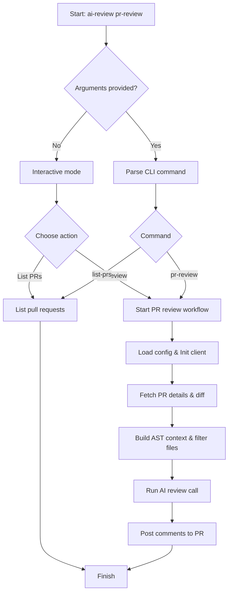

# Execution Flow

The diagram below summarizes how the review application moves from CLI entry to PR analysis and comment posting.

```mermaid
flowchart TD
  Start[Start: ai-review pr-review] --> CheckArgs{Arguments provided?}
  CheckArgs -->|No| Interactive[Interactive mode]
  CheckArgs -->|Yes| Parse[Parse CLI command]

  Interactive --> Action{Choose action}
  Action -->|PR review| PRReview[Start PR review workflow]
  Action -->|List PRs| ListPRs[List pull requests]
  
  Parse --> Command{Command}
  Command -->|pr-review| PRReview
  Command -->|list-prs| ListPRs

  PRReview --> Config[Load config & Init client]
  Config --> FetchPR[Fetch PR details & diff]
  FetchPR --> BuildContext[Build AST context & filter files]
  BuildContext --> AI[Run AI review call]
  AI --> Post[Post comments to PR]
  
  ListPRs --> End[Finish]
  Post --> End
```
